Вже багато років я пишу на Java. Звичайна повсякденна робота: пишу сервіси, виправляю баги. Як і будь-який звичайний розробник. Але нещодавно я спіймав себе на тому, що я почав забувати деякі основи і те, що відбувається під капотом. Глибоко під капотом. Речі, які зазвичай не зустрічаються в повсякденні.
Я просто уявив, що я буду відчувати, якщо хтось із колег запитає мене про JVM, байткод чи JIT, а я, маючи 15+ років досвіду, мушу відповісти на це правильно і розгорнуто.

<!--more-->

Тож ця стаття — це розбір теми, який я сам хотів би отримати багато років тому: що відбувається між кодом, який ми пишемо, та інструкціями, які виконує процесор. І що тримає сервіс живим.

## Ланцюжок від початку до кінця

Почнімо з бази.

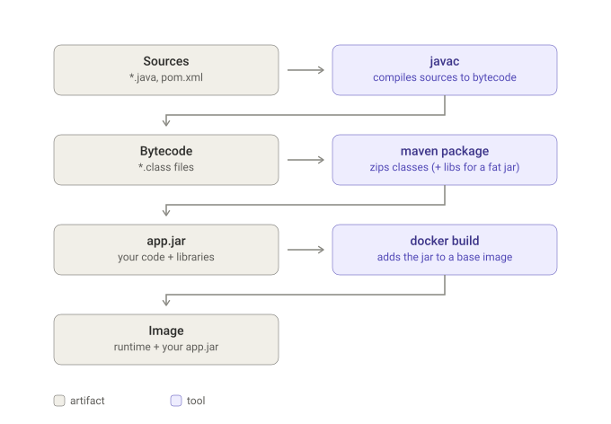

Тут три моменти:

1. **javac майже нічого не оптимізує.** Він перевіряє типи і розгортає синтаксичний цукор. Окрім згортання константних виразів і підстановки значень `static final` констант, він перекладає код у байткод майже один в один. Він не вбудовує методи й не розгортає цикли. Усе це пізніше, під час виконання, зробить JIT. Через це байткод так і схожий на вихідний код і тому декомпілятори так добре справляються.

2. **Packaging нічого не компілює.** Сама команда `mvn package` проходить життєвий цикл від validate і до фази package, включно з компіляцією та тестами: validate → compile → test → package. Фази verify → install → deploy ідуть уже після неї, і `mvn package` їх не запускає. Але сам крок package лише бере class-файли, які вже існують, і архівує класи та ресурси в jar. Залежності з `~/.m2` потрапляють в jar, лише якщо окремий плагін збирає fat jar, наприклад `spring-boot-maven-plugin`. Jar — це лише zip-файл із папкою `META-INF` усередині.

3. **`docker build` нічого не знає про Java.** Він просто копіює файл у шар файлової системи. Усе, що стосується Java, береться з базового образу.


**То що ж таке JDK та JRE і що вони приховують?**

Стандартна бібліотека — це не щось лише для етапу збірки. Код програми звертається до `java.util` і `java.io` постійно під час виконання, тож бібліотека має бути присутня в рантаймі.

Вкладеність така:

```
JVM = віртуальна машина, яка виконує байткод
JRE = JVM + стандартна бібліотека класів + лаунчер java
JDK = JRE + інструменти розробки (javac, jar, javadoc, jdeps, jlink, jshell, jdb)
```

Тож різниця між JDK і JRE — не набір бібліотек проти інструментів виконання. JRE — це все, що потрібно для *запуску*. JDK — це JRE плюс усе, що потрібно для *збірки*. Найбільше, чого бракує в JRE, — це `javac`.

А сторонні бібліотеки — Spring, Jackson, JDBC-драйвер — не входять ні в те, ні в інше. Вони приходять на етапі збірки. Або через classpath, або запаковані в fat jar.

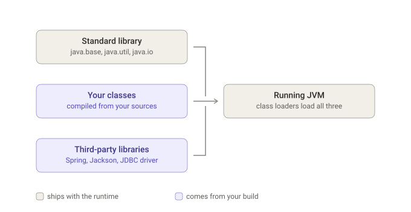

Розгортка виглядає так:

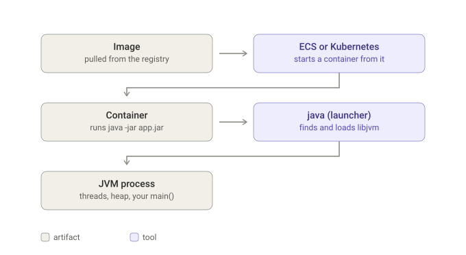

Тут видно, що рантайм фізично живе всередині образу. Базовий образ типу `eclipse-temurin:21-jre` — це Linux плюс папка з `bin/java` і `lib/modules`. Jar лежить поверх нього.

Цю папку можна зібрати й самому за допомогою `jlink`, взявши лише ті модулі, які потрібні конкретному застосунку:

```bash
jlink --add-modules java.base,java.sql --strip-debug --no-man-pages --no-header-files --output /runtime
```

Це також відповідь на питання, яке колись виникло в мене: чому Oracle не випускає окремого JRE починаючи з Java 11? Тому що з Java 9 рантайм — це набір модулів, і будь-хто може зібрати рантайм, який точно відповідає потребам його застосунку. Дистрибутиви типу Temurin досі публікують збірки JRE для зручності. Але кому потрібен універсальний JRE?

А ще, починаючи з Java 10, JVM читає ліміти cgroup і бачить пам'ять та CPU *контейнера*, а не хоста. Але за замовчуванням під heap вона бере лише приблизно чверть доступної пам'яті, тому в контейнерних конфігураціях зазвичай додають аргумент `-XX:MaxRAMPercentage=75`.

## JVM — це просто процес


Довгий час я сприймав JVM як пісочницю для Java-коду. Але JVM — звичайний процес операційної системи, програма на C++: на диску вона лежить як `libjvm.so`, її запускають, вона читає файли й виділяє пам'ять. А байткод — це просто *дані*, які ця програма приймає. Завантажувачі класів, інтерпретатор, JIT, збирач сміття — окремих сутностей тут немає: це потоки й структури даних всередині одного процесу.

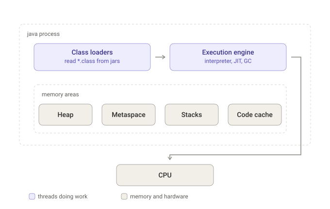

«Пісочницею» колись називали модель безпеки: SecurityManager, аплети, код, якому ви не довіряли. Цієї моделі більше немає. У Java 17 її оголосили застарілою і запланували до видалення, а в JDK 24 вимкнули назавжди. JVM більше не межа безпеки: код всередині неї може читати файли, відкривати сокети та викликати нативний код.

Звичайний процес `java -jar` ніколи не працював у пісочниці. Пісочниця вмикалася за бажанням: її можна було отримати, лише коли щось встановлювало SecurityManager, і за замовчуванням це робив браузер — аплети, Web Start, код, якому ніхто не довіряв. Коли SecurityManager був установлений, JDK звіряв чутливі виклики з файлом політик: відкриття файлу чи підключення сокета спершу запитувало дозвіл. Без нього, а це майже кожен звичайний серверний застосунок, ці перевірки не робили взагалі нічого. А тепер цей механізм вимкнено назавжди, і його API заплановано до видалення.

А от що JVM справді гарантує, так це безпеку пам'яті. У байткоді взагалі немає адрес як таких: доступ до поля йде через символьне посилання з constant pool, а до елементів масиву — через інструкції, які перевіряють межі ще до звернення до пам'яті. Та й взагалі, GC ж переміщує об'єкти, і адреса могла б застаріти в будь-який момент.

JVM захищає програму від неї самої: ви не можете дістатися до пам'яті, на яку вам ніколи не давали посилання. Операційна система захищає машину від програми, адже до іншого процесу програмі не дістатися. Ізоляцію в продакшені дають контейнер, обмеження прав доступу ОС та ядро, але не JVM.

З безпекою розібралися. Тепер про те, що всередині цього процесу, — а там чотири області пам'яті:

- **Heap** — кожен об'єкт, який створюється через `new`. Спільний для всіх потоків, ним керує GC. Тут же кожен завантажений клас отримує свій об'єкт `java.lang.Class` — *mirror*, і статичні поля лежать усередині нього, після власних полів mirror. Статичне поле посилального типу містить лише посилання. Об'єкт, на який воно вказує, — звичайний об'єкт у heap.
- **Metaspace** — метадані класів: сама структура класу (`InstanceKlass` у HotSpot), описи його полів і методів, байткод цих методів і constant pool. Сюди завантажувач класів і кладе клас. Лежить усе це в нативній пам'яті, поза heap. Значень статичних полів тут немає: `InstanceKlass` зберігає лише вказівник на mirror і зміщення статичних полів усередині нього.
- **Stack** — по одному на потік. Фрейми з локальними змінними, аргументами й адресами повернення.
- **Code cache** — сюди JIT записує машинний код.

## Що відбувається під час запуску

Послідовність така:

1. Лаунчер `java` — це невелика нативна програма. Він розбирає аргументи, знаходить `libjvm` (це і є HotSpot) і завантажує її.
2. Ергономіка (автоналаштування) зчитує ліміти машини чи контейнера й обирає розмір heap і збирач сміття. Пам'ять резервується.
3. Стартують службові потоки: потоки GC, потоки компіляторів, обробник сигналів.
4. Початковий завантажувач класів (bootstrap class loader) завантажує ядро з `lib/modules` у metaspace: `Object`, `String`, `Class`, `Thread`. Сотні класів — і все це ще до вашого коду. Щоб пришвидшити цей процес, JDK постачається з архівом CDS — заздалегідь підготовленим знімком (snapshot) цих класів.
5. Java-частина лаунчера відкриває jar, читає `Main-Class` з `META-INF/MANIFEST.MF`, і завантажувач класів застосунку (application class loader) завантажує цей клас.
6. Виклик `main` запускає лінкування (статичні поля отримують значення за замовчуванням) та ініціалізацію (виконуються блоки `static {}`). Лише після цього виконується перший рядок `main`.
7. Далі класи завантажуються ліниво — кожен тоді, коли щось уперше до нього звертається.

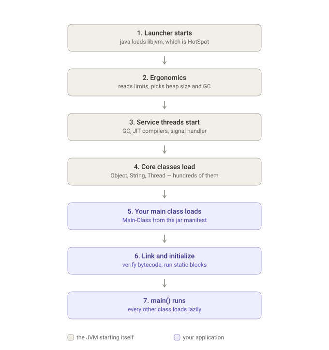

Останній пункт пояснює, чому через відсутній клас застосунок падає не на старті. Він падає з `NoClassDefFoundError` тієї миті, коли виконання доходить до коду, якому цей клас потрібен, — часом через години. Звідси ж і повільний старт Spring Boot: він ще на старті створює всі singleton-біни, а для цього мусить завантажити, верифікувати та ініціалізувати тисячі класів. Але тоді й частина таких помилок вилазить одразу, а не через години.

До речі, якщо застосунок — fat jar Spring Boot, `Main-Class` у маніфесті вказує зовсім не на ваш клас, а на власний `JarLauncher` Spring Boot. Ваш клас записаний у `Start-Class`. Звичайна JVM не вміє завантажувати jar, вкладений у jar, тому Spring Boot спершу встановлює власний завантажувач класів.

## Байткод та інтерпретатор

Байткод — це список інструкцій для *стекової машини*. У ньому немає ні регістрів, ні адрес пам'яті — лише «поклади це на стек» і «зніми те зі стеку».

Кожен виклик методу створює на стеку потоку фрейм із двох частин: масиву локальних змінних і стека операндів. У методі екземпляра нульовий слот локальних змінних завжди займає `this`, а стек операндів слугує робочим простором, на якому інструкції залишають свої значення. `javac` обчислює розмір обох ще під час компіляції та записує їх у class-файл як `max_locals` і `max_stack`. Тому JVM знає точний розмір фрейму ще до виконання, а верифікатор, який проходить байткод ще до першого запуску методу, може заздалегідь перевірити, що стек не переповниться і типи зійдуться.

Візьмімо такий метод:

```java
int add(int a, int b) {
    int c = a + b;
    return c;
}
```

Запустіть `javap -c` на скомпільованому класі та отримаєте шість інструкцій:

```
0: iload_1
1: iload_2
2: iadd
3: istore_3
4: iload_3
5: ireturn
```

Ось що роблять перші чотири:

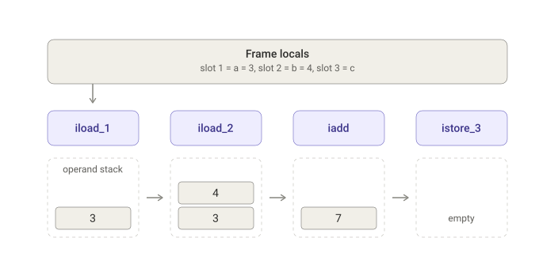

`iload_1` каже «візьми слот 1, поклади на стек». `iadd` — «зніми два, додай, поклади результат». `istore_3` означає «зніми верхнє значення, запиши в слот 3». Після цього `c` містить 7, а стек знову порожній. Те саме додавання в машинному коді x86 буде лише одна інструкція `add` над двома регістрами.

**Як інтерпретатор це виконує.** У HotSpot це шаблонний інтерпретатор, і працює він так:

1. Під час старту VM для кожного з приблизно двохсот кодів операції (opcode) генерується машинний код — шаблон для `iload`, ще один для `iadd`, для `invokevirtual` і так далі. І все це один раз, ще до того, як завантажиться хоч один клас застосунку.
2. У таблиці диспетчеризації кожному коду операції відповідає адреса його шаблону.
3. Виконати метод — означає прочитати його байти по одному. Взяти код операції, перейти до його шаблону. Шаблон виконує роботу, читає наступний код операції та знову переходить. Зовнішнього циклу немає: диспетчеризація вбудована в кінець кожного шаблону.
4. Вершина стеку операндів тримається в регістрі, і не кожен крок мусить лізти в пам'ять.

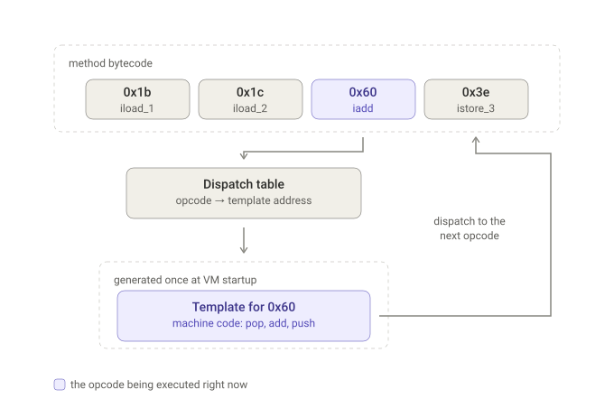

І ось чому інтерпретація дорога. Кожен окремий байткод — це пошук у таблиці та непрямий перехід, а операнди живуть у пам'яті фрейму, а не в регістрах. А головне — інтерпретатор бачить одну інструкцію за раз і ніяк не може помітити, що `iload_1, iload_2, iadd` — це просто додавання двох регістрів. JIT бачить весь метод — звідси й перевага.

Цікаво, що інтерпретатор нікуди не зникає навіть у сервісі, який працює довго:

- На старті скомпілювати все було б набагато дорожче, ніж просто виконати, а більшість коду виконується лише кілька разів.
- Інтерпретатор збирає профіль: поки виконує метод, рахує виклики та ітерації циклів. Без цього профілю оптимізатору немає з чим працювати.
- На нього спирається деоптимізація (про неї — в розділі про JIT). Коли припущення, на якому ґрунтувалася спекулятивна оптимізація, не справджується, виконання треба кудись повернути, і повертається воно в інтерпретатор: JVM розбирає скомпільований фрейм і відбудовує фрейм інтерпретатора на конкретній інструкції.
- У ньому живуть холодний код і щойно завантажені класи.

## JIT

JIT працює з байткодом — вихідного коду JVM не бачить взагалі — і компілює по одному методу, коли лічильники покажуть, що метод гарячий.

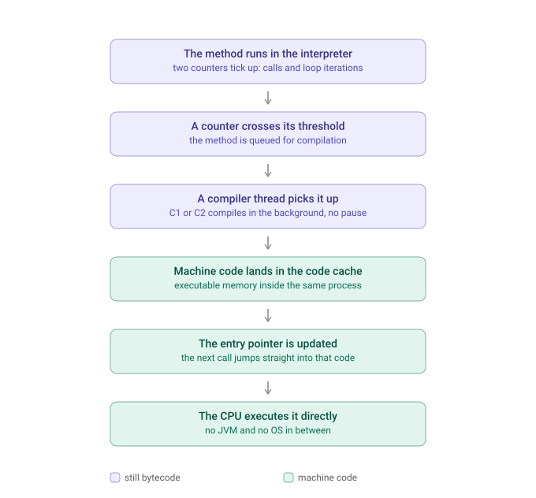

Кожен метод має два лічильники: скільки разів його викликали та скільки зворотних переходів зробили його цикли. Коли лічильник перетинає поріг, метод стає в чергу на компіляцію. Фоновий потік компілятора бере його байткод і компілює в машинний код, а застосунок тим часом продовжує працювати в інтерпретаторі — жодної паузи. JVM записує результат у code cache — область нативної пам'яті всередині того самого процесу, з якої дозволено виконувати код. Потім оновлює вказівник входу методу, і наступний виклик іде прямо туди.

Тепер CPU виконує ці байти напряму. Між ними нічого немає: ні JVM, ні ОС. JVM брала участь рівно один раз — коли запросила в ОС пам'ять, яку дозволено виконувати. Те саме робить скомпільована програма на C, з тією лише різницею, що код з'явився в пам'яті під час роботи програми, а не був прочитаний із файлу.

Сам переклад у машинний код мало що дає. Виграш з'являється, коли компілятор бачить весь метод: локальні змінні переїжджають у регістри CPU, малі методи вбудовуються в місця виклику, мертві гілки зникають, цикли розгортаються. На гарячому коді різниця з інтерпретатором може сягати десятків разів.

Компіляція багаторівнева. Рівень 0 — інтерпретатор. Рівень 3 — C1: компілює швидко, код дає посередній, але збирає профіль — які гілки виконуються, які типи насправді трапляються в точці виклику. Рівень 4 — C2: компілює повільно, але використовує зібраний C1 профіль і дає дуже ефективний код. Насправді рівнів п'ять, і до них ми ще повернемося.

Ці оптимізації спекулятивні, і їх можна скасувати. Якщо C2 побачив, що в точку виклику приходить лише один тип, він вбудує виклик і захистить його перевіркою. Якщо з'явиться інший тип, перевірка не пройде, скомпільований код викинуть, а виконання продовжиться в інтерпретаторі. Це і є деоптимізація.

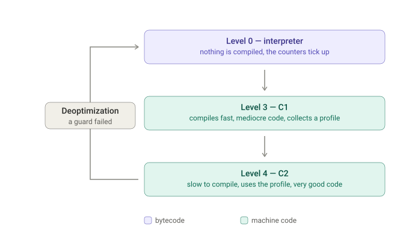

Є ще один випадок: метод викликається рівно один раз, а всередині — цикл на мільйон ітерацій. Лічильник викликів ніколи не зробить його гарячим. Для цього і існує ще один лічильник. Коли спрацьовує він, JVM компілює метод і перемикає виконання *посеред циклу, що вже працює*, перебудовуючи фрейм інтерпретатора на скомпільований фрейм. Так працює on-stack replacement (OSR).

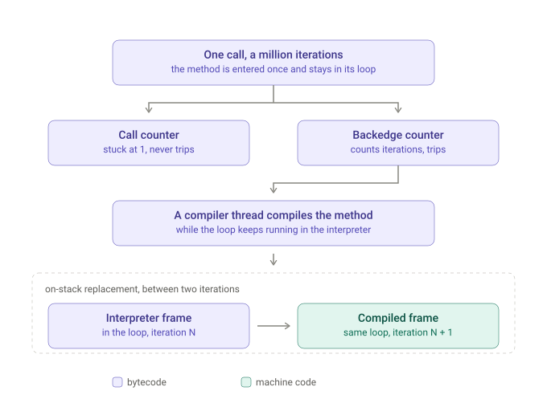

## П'ять рівнів і маршрути між ними

У кожен момент метод сидить на одному з п'яти рівнів виконання, і рівень показує дві речі: хто створив код, що виконується, і скільки даних ми з цього коду збираємо.

| Рівень | Хто виконує код | Що збирає                                                                       |
| ------ | --------------- |---------------------------------------------------------------------------------|
| 0 | інтерпретатор | лічильники викликів і циклів                                                    |
| 1 | C1 | нічого                                                                          |
| 2 | C1 | лише лічильники                                                                 |
| 3 | C1 | повний профіль: які гілки виконуються, які типи надходять в кожну точку виклику |
| 4 | C2 | нічого                                                                          |

Рівні 1, 2 і 3 — це один компілятор, і код в них однакової якості. Відрізняється лише вбудована в нього інструментація. Якщо ж відсортувати рівні за швидкістю, вийде 0 ≪ 3 < 2 < 1 < 4: код рівня 1 швидший за код рівня 3, адже не збирає профіль і не зупиняється, щоб його записати.

За профілювання доводиться платити, і JVM платить лише там, де ці дані справді будуть використані.

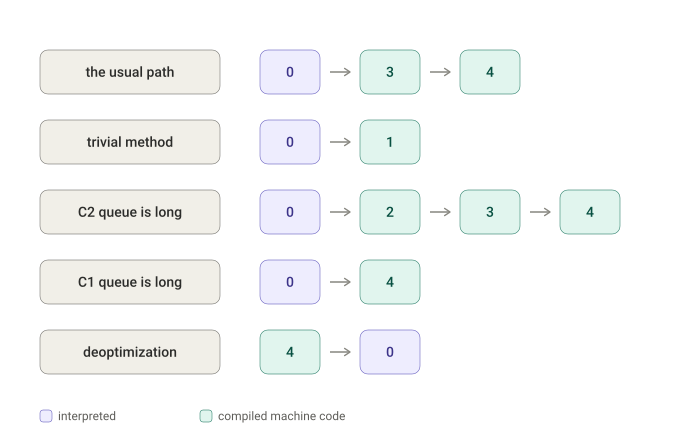

**0 → 3 → 4** — звичайний маршрут. На рівні 0 лічильники спрацьовують в інтерпретаторі, C1 компілює метод із повним профілюванням на рівні 3, цей скомпільований код продовжує рахувати, і якщо метод лишається гарячим, він переходить на рівень 4, де C2 компілює його ще раз, використовуючи зібраний профіль.

**0 → 1** — коли метод тривіальний: аксесор або метод, що повертає константу. Політика розпізнає його ще до будь-якого профілювання та одразу відправляє в C1 без інструментації: C2 дав би той самий результат, і профіль, за який заплатили, ніхто б не прочитав.

**0 → 2 → 3 → 4** — так виглядає довга черга C2. Виконувати повільний профільований код весь час очікування було б марнотратством. Тому метод спершу отримує швидкий код C1 з дешевими лічильниками, а повний профіль JVM збере пізніше, ближче до компіляції в C2.

**0 → 4** — дзеркальний випадок: C1 зайнятий, профіль збирається в інтерпретаторі, і метод іде одразу в C2.

За цими стрілками ховаються два окремі рішення:

1. На рівні 3 JVM вирішує, чи варто C2 витрачати на метод час. Для цього JVM порівнює лічильники рівня 3 з порогами рівня 4. На той момент метод вже скомпільований і гарячий.
2. Компілятор вирішує, чи може C2 справді зробити краще: він читає профіль і може відмовитися від компіляції.

Ще два фільтри стоять осторонь цих рішень:

1. Політика ніколи не компілює метод, у якому понад 8000 байт байткоду, на жодному рівні (але `-XX:-DontCompileHugeMethods` знімає це обмеження).
2. Перевірку на тривіальність, яка відправляє метод на рівень 1, політика робить ще до того, як C2 його побачить.

**4 → 0** — це деоптимізація: вона скидає метод назад на рівень 0, де він знову починає збирати профіль і його цілком можуть перекомпілювати. Якщо невдачі повторюються, JVM здається в три кроки. Спершу вона відмовляється від окремої спекуляції: коли та сама перевірка на тому самому байткоді не пройшла кілька разів, метод перекомпілюється без цього припущення, і точка виклику, яка тепер побачила три різні типи, стає звичайним віртуальним викликом замість вбудованого. Потім JVM взагалі припиняє спекулювати в цьому методі. І лише після кількох сотень перекомпіляцій метод позначають як непридатний для C2, і до кінця роботи процесу він працює як звичайний код C1 на рівні 1 — що на практиці означає або патологічний код, або баг компілятора.

Є ще один спосіб, у який компіляція зупиняється: переповнюється code cache. Тоді можна побачити `CodeCache is full. Compiler has been disabled` в логах, і JVM перестає компілювати нові методи. Уже скомпільований код продовжує працювати, але все, що стає гарячим відтепер, лишається в інтерпретаторі. З увімкненим за замовчуванням `-XX:+UseCodeCacheFlushing` JVM знову запускає компілятор, щойно вивантажиться достатньо коду. У продакшені це виглядає як сервіс, що без видимих причин працює дедалі повільніше.

## Потоки вирішують, коли процес помирає

Я колись задавався питанням, чому `main` вже повернув керування, а процес Spring Boot живе далі.

Якщо коротко — бо JVM працює, доки живий хоча б один не-daemon потік.

Потік `main` завершується, і JVM перевіряє, чи лишилися не-daemon потоки. Якщо так, процес працює далі. Daemon-потоки — навпаки: вони нічого не утримують. Щойно зникає останній не-daemon потік, JVM запускає shutdown hooks і вбиває daemon-потоки, де б вони в цей момент не були. До того ж їхні блоки `finally` не виконуються.

Щоб вебсервіс залишався живим, йому потрібен не-daemon потік. `TomcatWebServer` у Spring Boot явно запускає такий потік з іменем `container-0` і викликає на ньому `setDaemon(false)`. Цей потік просто стоїть і чекає, утримуючи JVM живою.

---

JVM — не магія і не пісочниця. Це звичайна програма на C++: читає байткод, тримає в порядку власну пам'ять і переписує гарячі частини на машинний код, поки сервіс працює.

---

> 🤖 Думки й слова мої. ШІ допоміг лише відшліфувати мову й тримати структуру.
>
> Якщо цитуєте чи поширюєте цей текст, будь ласка, вказуйте джерело.
>
> Я пишу про JVM, надійність і щоденну інженерію в [LinkedIn](https://www.linkedin.com/in/vadym-novakovskyi/) — підписуйтеся, якщо вам таке цікаво.
